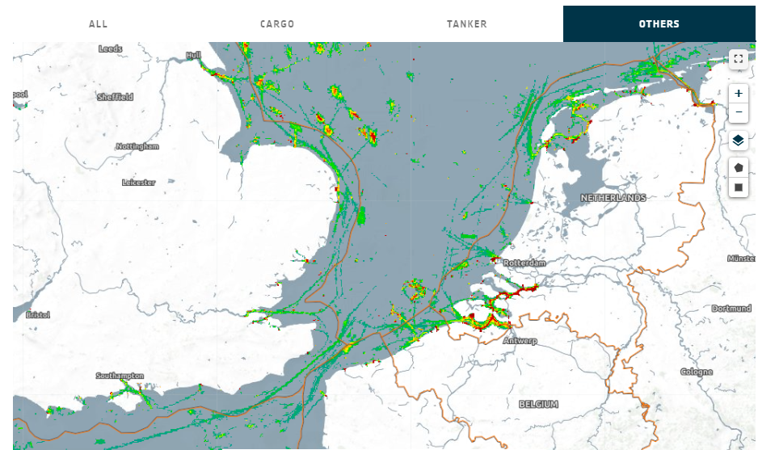

# Vessel_Density

## Short description

These maps have been made from ship reporting data of the Automatic Identification System (AIS), collected by coastal stations and satellites.
EMODnet Human Activities creates vessel density maps of EU waters showing the average number of vessels of certain type (cargo, passenger, fishing etc.) in a given period within a grid cell.
The EMODnet Human activities portal provides options for visualisation and download of the maps.
The maps provide the total ship presence time on a 1 km grid that follows EEA/Inspire standards, for every month from 2017-2020, separately for 14 different ship categories.
The total ship presence times are converted to average instantaneous number of ships per square km.
Users that are interested to learn more about the full map production method based on AIS data can refer to the 2019 report "EU Vessel density map Detailed method linked below.

## Band information

The products has been split into several products as for ship types:

- Vessel_Density_other: including the ship types classified as "other". Band = "other"

## More information

- [Data Source](https://www.emodnet-humanactivities.eu/view-data.php)
- [Data Documentation](https://www.emodnet-humanactivities.eu/documents/Vessel%20density%20maps_method_v1.5.pdf)
- [Data and Metadata information](https://www.emodnet-humanactivities.eu/search-results.php?dataname=Vessel+Density+)

### Ship Type other

 
*Ship Type other density map*
